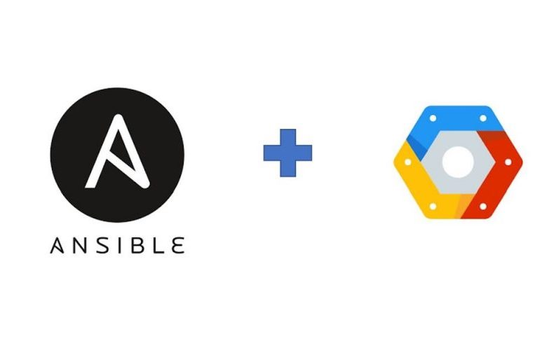

# GCloud Ansible runner image



## Purpose

This repo is meant to provide all the required artifacts to build an Ansible runner OCI compliant container image, to be used as an Execution Environment in Ansible AWX or Tower, with gcloud tool bundled in it.

This can be very useful in the case you need to provision a GCE compute with Ansible AWX/Tower leveraging the Google IAP ssh connection mechanism.

## Limitations

This runner version works only against Linux VMs.

## Requirements

- To build the runner one between **Docker** or **Podman** must be installed locally.
- **Python PIP** package manager must be must be installed locally.
- Also, the **ansible-builder** tool must be must be installed locally

To install the **ansible-builder** tool type the following:

```
$ pip install ansible-builder
```

## How to build the runner image

Build the runner

```
$ ansible-builder build \
    --container-runtime docker \
    --verbosity 3 \
    --context . \
    --tag=ansible-runner-gcloud:latest
```

## Test the runner image

To test the runner locally

```
$ docker run -e ZONE=$ZONE -e PROJECT=$PROJECT -e HOSTNAME=$HOSTNAME -ti --rm --entrypoint /bin/bash ansible-runner-gcloud:latest 
# gcloud auth login
# export PROJECT=my-project
# export HOSTNAME=my-compute
# cd /home/runner/
# ./scripts/gcp-ssh-wrapper.sh \
    --tunnel-through-iap \
    --zone=$ZONE \
    --no-user-output-enabled \
    --quiet \
    --strict-host-key-checking=no \
    --project=$PROJECT \
    -o StrictHostKeyChecking=no \
    -o KbdInteractiveAuthentication=no \
    -o PreferredAuthentications=gssapi-with-mic,gssapi-keyex,hostbased,publickey \
    -o PasswordAuthentication=no \
    -o 'User="ansible"' \
    -o ConnectTimeout=10 \
    $HOSTNAME '/bin/sh -c '"'"'whoami'"'"''
```


```
# ansible all -i $HOSTNAME, -m ping
```


```
# ansible-playbook -i $HOSTNAME, playbooks/test.yaml 
```